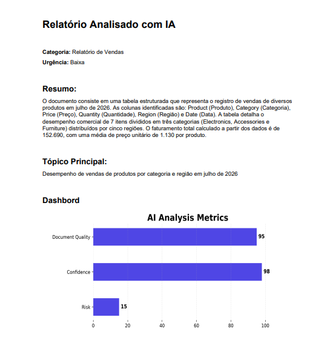

# AnalysIs

Analysis was designed not only to summarize documents, but also to analyze their content, identify key points, evaluate document quality, estimate confidence and risk, and generate structured insights using Google Gemini AI.


## Features

- 📄 PDF analysis
- 📊 Excel analysis
- 🤖 Google Gemini integration
- 📈 Dashboard generation
- 📑 Automatic PDF report generation
- 🧩 Modular architecture

## Technologies

- Python
- Google Gemini API
- PyMuPDF
- OpenPyXL
- Matplotlib
- ReportLab
- Tkinter

```bash
git clone https://github.com/LucasAs3/AnalysIs.git

cd AnalysIs

pip install -r requirements.txt
```


## 📑 PDF Report:

```text
User

↓

File Manager

↓

Reader

↓

Gemini

↓

Report
```

